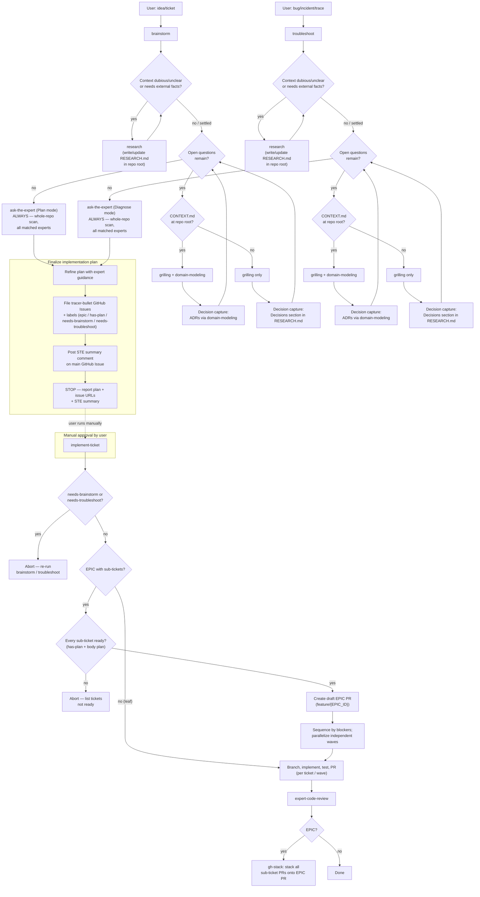

# Grok Build

Configuration, agents, and skills for [Grok Build](https://x.ai) (`~/.grok/`).

## Contents

| Path | Description |
| --- | --- |
| `config.toml` | Portable Grok config — models, UI theme, LSP feature flag, MCP servers, and permission rules. Uses **`${ENV}` placeholders** for secrets (see [MCP config](#mcp-config)). |
| `lsp.json` | LSP server configurations for TypeScript (typescript-language-server), Python (pyright), and Rust (rust-analyzer). |
| `agents/` | Custom subagent definitions (domain experts + analyzers). |
| `skills/` | Agent skills (portable instructions invoked by name or automatically based on their description). |

### Agents (`agents/`)

Domain experts share four consultation **modes** (used by `ask-the-expert` and related skills):

| Mode | When |
| --- | --- |
| **Review** | Critique existing/changed code, config, SQL, monitors, etc. |
| **Plan** | Validate an approach before implementation (e.g. from `brainstorm`). |
| **Diagnose** | Ranked root-cause hypotheses from evidence / live signals (e.g. from `troubleshoot`). |
| **Question** | Direct how/what/why technical Q — answer first, then brief rationale. |

| Agent | Purpose |
| --- | --- |
| `bun-expert.md` | Bun / TypeScript-JS runtime expert (Biome, Bun SQL/RabbitMQ/S3 APIs, security) — Review, Plan, Diagnose, Question. |
| `ci-cd-expert.md` | CI/CD & delivery expert (GitHub Actions, Terraform pipelines, Helm charts, container build/deploy, CI shell) — Review, Plan, Diagnose, Question. |
| `datadog-analyzer.md` | Datadog observability expert — live metrics/logs/traces/monitors/events (Diagnose), instrumentation/monitor review (Review), observability strategy (Plan), and product/query Q&A (Question). |
| `gis-expert.md` | GIS / geospatial expert (GeoTools, GDAL, Turf.js, PostGIS, Shapely, CRS, spatial indexing) — Review, Plan, Diagnose, Question. |
| `postgres-expert.md` | PostgreSQL expert (SQL, schema/indexes, migrations, locking, EXPLAIN, ORM SQL) — Review, Plan, Diagnose, Question. |
| `python-expert.md` | Python expert for web (FastAPI/Flask/Django), AWS Lambda/serverless, and data/ML (pandas, NumPy, Polars, TensorFlow/Keras, scikit-learn) — Review, Plan, Diagnose, Question. |
| `rust-expert.md` | Rust expert across async services (Tokio/Axum, PostgreSQL, RabbitMQ, S3), CLI (clap/argh), and client/desktop/WASM (Tauri, egui/iced/Dioxus/Slint, wasm-bindgen, Leptos/Yew) — Review, Plan, Diagnose, Question. |
| `spring-cloud-expert.md` | Java/Spring Cloud microservices expert (correctness, resilience, security, Kubernetes readiness) — Review, Plan, Diagnose, Question. |
| `swift-expert.md` | Swift expert across client (SwiftUI/UIKit/AppKit), server (Vapor/Hummingbird/SwiftNIO), and CLI (swift-argument-parser, SwiftPM) — Review, Plan, Diagnose, Question. |
| `web-frontend-expert.md` | Web frontend expert (React, Next.js, Svelte, a11y, responsiveness, performance) — Review, Plan, Diagnose, Question. |

### Skills (`skills/`)

| Skill | Description |
| --- | --- |
| `ask-the-expert` | Authoritative tech-specific consult via domain experts. Use when code review, implementation planning, or troubleshooting touches Rust, Bun/TypeScript, Java/Spring Cloud, Python (web, Lambda, data/ML), GIS, web front-end, Swift, PostgreSQL, Datadog, or CI/CD (GitHub Actions, Terraform, Helm, shell pipelines) — or whenever another skill needs specialist input beyond generalist knowledge. |
| `aws-sso-login` | Authenticate to AWS using Single Sign-On (SSO). Use when AWS CLI operations require SSO authentication or when SSO session has expired. |
| `brainstorm` | Plan an improvement ticket or idea into tracer-bullet work and GitHub Issues. Ends with an STE summary comment on the main ticket, documented grilling decisions (ADRs or `RESEARCH.md`), and readiness labels on every touched issue. |
| `datadog-health-report` | Consolidated Datadog health report for a scoped area of responsibility — use before a daily standup or SoS when you need metrics, logs, traces, monitors, SLOs, and incidents synthesized into a meeting-ready summary. |
| `expert-code-review` | Expert code review via domain specialists. Use when the user wants recently written or modified code reviewed, a branch or PR reviewed, or feedback on security, performance, idioms, architecture, or CI/CD delivery automation (GitHub Actions, Terraform, Helm, shell pipelines). |
| `implement-ticket` | Execute a brainstorm/troubleshoot plan for a GitHub Issue or EPIC (branch, implement, PR, review). For EPICs, require every sub-ticket plan, sequence by blockers, implement independent tickets in parallel, and stack all sub-ticket PRs onto the EPIC PR at the end using gh-stack. |
| `query-postgres` | Connect to Postgres databases via the psql CLI using per-environment credential files (e.g. env.prod) and run SQL queries. Use when the user wants to query a Postgres database, inspect or analyze data, run ad hoc SQL, or explore schema. Defaults to a read-only session and requires explicit user confirmation plus `--write` to run INSERT/UPDATE/DELETE/DDL statements. |
| `test-containers` | Brings up (and tears down) the containers a project needs for its integration tests, using whichever container runtime is available — docker, podman, or the macOS-native "container" CLI, checked in that priority order. Use when the user asks to prepare/start/stop containers for integration tests, e.g. "prepare for IT tests", "start the docker containers for integration tests", "bring up containers for the ITs", "spin up podman for tests", or before running an integration test suite that requires a database/broker/etc. running in containers. |
| `troubleshoot` | Diagnose a bug/incident (issue, Datadog trace id, or Zipkin Trace Id) into a fix plan and tracer-bullet work. Same end-state gates as `brainstorm`: STE summary on the main ticket, documented grilling decisions, readiness labels. |

### Required external skills

The following skills are **not included** in this repo, but are required for some of the above skills to work (`brainstorm`, `troubleshoot`, `implement-ticket`). Install them from their upstream sources.

| Skill | Description | Source |
| --- | --- | --- |
| `gh-stack` | Manages stacked PRs and splits multi-part work into reviewable branches with gh-stack. Use for stack creation, viewing, edits, push, submit, sync, rebase, merge, or checkout; when asked to split or isolate work for review; whenever a user mentions a stack, branch layers, dependent PRs, or gh stack; or when a stack is checked out. | [github/gh-stack](https://github.com/github/gh-stack) (`skills/gh-stack`) |
| `grilling` | Grill the user relentlessly about a plan, decision, or idea. Use when the user wants to stress-test their thinking, or uses any 'grill' trigger phrases. | [mattpocock/skills](https://github.com/mattpocock/skills/tree/main/skills/productivity/grilling) |
| `grill-me` | A relentless interview to sharpen a plan or design. (User-invoked wrapper around `grilling`.) | [mattpocock/skills](https://github.com/mattpocock/skills/tree/main/skills/productivity/grill-me) |
| `domain-modeling` | Build and sharpen a project's domain model. Use when the user wants to pin down domain terminology or a ubiquitous language, record an architectural decision, or when another skill needs to maintain the domain model. (`brainstorm` / `troubleshoot` use it with `grilling` when root `CONTEXT.md` exists, including ADR capture.) | [mattpocock/skills](https://github.com/mattpocock/skills/tree/main/skills/engineering/domain-modeling) |
| `prototype` | Build a throwaway prototype to answer a design question. Use when the user wants to sanity-check whether a state model or logic feels right, or explore what a UI should look like. | [mattpocock/skills](https://github.com/mattpocock/skills/tree/main/skills/engineering/prototype) |
| `research` | Investigate a question against high-trust primary sources and capture the findings as a Markdown file in the repo. Use when the user wants a topic researched, docs or API facts gathered, or reading legwork delegated to a background agent. | [mattpocock/skills](https://github.com/mattpocock/skills/tree/main/skills/engineering/research) |

### Optional external skills

Useful companion skills that are **not required** by the skills in this repo. Handy for reading office documents, authoring agent docs, and multi-session learning.

| Skill | Description | Source |
| --- | --- | --- |
| `convert-documents-to-markdown` | Convert Word (.doc, .docx), PowerPoint (.ppt, .pptx), Excel (.xls, .xlsx), OpenDocument (.odt, .ods, .odp), RTF, EPUB, CSV, and PDF files to GitHub-Flavored Markdown. Use when a task needs the contents of an office document, spreadsheet, presentation, ebook, or PDF you cannot read directly. | [firecrawl/anydoc](https://github.com/firecrawl/anydoc/tree/main/skills/convert-documents-to-markdown) |
| `teach` | Teach the user a new skill or concept, within this workspace. | [mattpocock/skills](https://github.com/mattpocock/skills/tree/main/skills/productivity/teach) |
| `writing-for-agents` | Writing documents for agents. Use when creating or editing skills, or modifying AGENTS.md or CLAUDE.md. | [mattpocock/skills](https://github.com/mattpocock/skills/tree/main/skills/productivity/writing-for-agents) |

#### Install external skills

**gh-stack** (CLI extension + agent skill):

```sh
# GitHub CLI extension (required for `gh stack` commands)
gh extension install github/gh-stack

# Agent skill (so coding agents know how to drive stacked PRs)
gh skill install github/gh-stack
```

**mattpocock/skills** (required: `research`, `grilling`, `grill-me`, `domain-modeling`, `prototype`; optional: `teach`, `writing-for-agents`; …):

```sh
# Codex and other agents — interactive picker; select the skills you need
npx skills@latest add mattpocock/skills

# Or install individual skills via the gh skill CLI, e.g.:
gh skill install mattpocock/skills research
gh skill install mattpocock/skills grilling
gh skill install mattpocock/skills domain-modeling
gh skill install mattpocock/skills prototype
gh skill install mattpocock/skills grill-me

# Optional companions
gh skill install mattpocock/skills teach
gh skill install mattpocock/skills writing-for-agents
```

Claude Code can also install the full set as a managed plugin:

```sh
claude plugins install mattpocock-skills
```

**firecrawl/anydoc** (optional: `convert-documents-to-markdown`):

```sh
npx skills add firecrawl/anydoc
# or:
gh skill install firecrawl/anydoc
```

The skill drives the anydoc CLI (`npx -y @firecrawl/anydoc <file>`); Node 20+ is required. No separate global install is needed for one-off conversions.

See the upstream READMEs for details: [mattpocock/skills](https://github.com/mattpocock/skills), [github/gh-stack](https://github.com/github/gh-stack), [firecrawl/anydoc](https://github.com/firecrawl/anydoc).

### Planning → implementation flow

`brainstorm` and `troubleshoot` **plan, document decisions, and file GitHub Issues** — they never write **implementation code**, run tests, or open branches/PRs. Allowed plan artifacts: root `RESEARCH.md`, `CONTEXT.md` / ADRs (via `domain-modeling`), and GitHub Issue creates/updates/comments. Implementation is always triggered manually by the user afterwards, via `implement-ticket`.

**End-state gates** (both skills; owned with `skills/brainstorm/references/tracer-ticket-breakdown.md`):

| Gate | Requirement |
| --- | --- |
| **STE summary on main** | Full plan + next steps in ASD-STE100 Simplified Technical English, posted as a **comment on the main GitHub Issue** (and shown to the user). Use ubiquitous language from `CONTEXT.md` when present. |
| **Decision capture** | Architectural decisions from grilling are on disk: **ADRs** via `domain-modeling` when root `CONTEXT.md` exists; otherwise a dated **Decisions** section in root `RESEARCH.md`. Skip only when grilling made none (state that in the plan). |
| **Labels** | Every issue **created or updated** in the run has the correct readiness label attached. |



**No implicit handoff:** neither `brainstorm` nor `troubleshoot` may call `implement-ticket` or otherwise start building. The user must explicitly invoke `implement-ticket` for a filed ticket (or EPIC) to begin implementation. Implementation starts only when grooming labels are clear and a body plan is present (`has-plan` preferred); for EPICs, **every** sub-ticket (and the parent) must pass those readiness gates.

## Installation

Grok loads user config from `~/.grok/`. Project-scoped MCP/plugins/permissions can also live in `.grok/config.toml` inside a repo.

From the repo root, symlink agents and skills (already the usual setup on this machine):

```sh
mkdir -p ~/.grok

# Agents + skills (directories)
ln -sfn "$(pwd)/ai/agents" ~/.grok/agents
ln -sfn "$(pwd)/ai/skills" ~/.grok/skills
```

### Config (`config.toml`)

**Do not blind-overwrite** `~/.grok/config.toml` if it already has marketplace or personal settings. Merge the sections you want from `ai/config.toml`:

| Section | What it carries |
| --- | --- |
| `[models]` | Default + web_search model (`grok-4.5`) |
| `[ui]` | Theme `auto` (system light/dark) |
| `[features]` | `lsp_tools = true` |
| `[session]` | Auto-compact threshold (partial stand-in for OpenCode DCP) |
| `[mcp_servers.*]` | crates-io, bun-mcp, datadog, github |
| `[permission]` | GitHub MCP ask/allow-read patterns |

### Layout reference

| Scope | Path |
| --- | --- |
| User config | `~/.grok/config.toml` |
| User TUI appearance | `~/.grok/pager.toml` (optional fine-grained UI) |
| User agents | `~/.grok/agents/<name>.md` |
| User skills | `~/.grok/skills/<name>/SKILL.md` |
| Project config | `.grok/config.toml` (MCP, plugins, permissions) |
| Project agents / skills | `.grok/agents/`, `.grok/skills/` |

### MCP config

MCP servers are defined under `[mcp_servers.*]` in `ai/config.toml`. Several need **per-user secrets** before they work. The repo uses `${ENV}` expansion so nothing sensitive is shared by default.

| Server | Env / fields | Notes |
| --- | --- | --- |
| `github` | `GITHUB_PERSONAL_ACCESS_TOKEN` | Classic or fine-grained PAT. Requires the `github-mcp-server` binary on `PATH`. |
| `datadog` | `DATADOG_MCP_TOKEN` | Used as `Bearer ${DATADOG_MCP_TOKEN}` for `mcp.datadoghq.eu`. **Disabled by default** (`enabled = false`). |
| `crates-io`, `bun-mcp` | usually none | Need `cratesio-mcp` / `bunx` available; no user token in-repo. |

Export tokens in your shell profile (or a secrets manager) before launching Grok:

```sh
export GITHUB_PERSONAL_ACCESS_TOKEN=ghp_...
export DATADOG_MCP_TOKEN=...   # when enabling Datadog MCP
```

Check connectivity with:

```sh
grok mcp list
grok mcp doctor
```

> [!WARNING]
> Never commit a populated config with real tokens. Only `${ENV}` placeholders should be tracked. Before `git add`/`commit`, confirm `git diff ai/config.toml` does not contain PATs, Bearer tokens, or other secrets.
