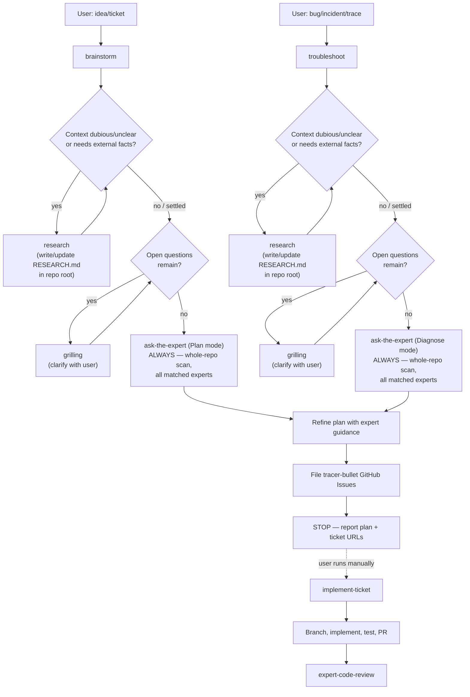

# Grok Build

Configuration, agents, and skills for [Grok Build](https://x.ai) (`~/.grok/`).

## Contents

| Path | Description |
| --- | --- |
| `config.toml` | Portable Grok config — models, UI theme, LSP feature flag, MCP servers, and permission rules. Uses **`${ENV}` placeholders** for secrets (see [MCP config](#mcp-config)). |
| `lsp.json` | LSP server configurations for TypeScript (typescript-language-server), Python (pyright), and Rust (rust-analyzer). |
| `agents/` | Custom subagent definitions (domain experts + analyzers). |
| `skills/` | Agent skills (portable instructions invoked by name or automatically based on their description). |

### Agents (`agents/`)

Domain experts share four consultation **modes** (used by `ask-the-expert` and related skills):

| Mode | When |
| --- | --- |
| **Review** | Critique existing/changed code, config, SQL, monitors, etc. |
| **Plan** | Validate an approach before implementation (e.g. from `brainstorm`). |
| **Diagnose** | Ranked root-cause hypotheses from evidence / live signals (e.g. from `troubleshoot`). |
| **Question** | Direct how/what/why technical Q — answer first, then brief rationale. |

| Agent | Purpose |
| --- | --- |
| `bun-expert.md` | Bun / TypeScript-JS runtime expert (Biome, Bun SQL/RabbitMQ/S3 APIs, security) — Review, Plan, Diagnose, Question. |
| `datadog-analyzer.md` | Datadog observability expert — live metrics/logs/traces/monitors/events (Diagnose), instrumentation/monitor review (Review), observability strategy (Plan), and product/query Q&A (Question). |
| `gis-expert.md` | GIS / geospatial expert (GeoTools, GDAL, Turf.js, PostGIS, Shapely, CRS, spatial indexing) — Review, Plan, Diagnose, Question. |
| `postgres-expert.md` | PostgreSQL expert (SQL, schema/indexes, migrations, locking, EXPLAIN, ORM SQL) — Review, Plan, Diagnose, Question. |
| `python-expert.md` | Python expert for web (FastAPI/Flask/Django), AWS Lambda/serverless, and data/ML (pandas, NumPy, Polars, TensorFlow/Keras, scikit-learn) — Review, Plan, Diagnose, Question. |
| `rust-expert.md` | Rust expert across async services (Tokio/Axum, PostgreSQL, RabbitMQ, S3), CLI (clap/argh), and client/desktop/WASM (Tauri, egui/iced/Dioxus/Slint, wasm-bindgen, Leptos/Yew) — Review, Plan, Diagnose, Question. |
| `spring-cloud-expert.md` | Java/Spring Cloud microservices expert (correctness, resilience, security, Kubernetes readiness) — Review, Plan, Diagnose, Question. |
| `swift-expert.md` | Swift expert across client (SwiftUI/UIKit/AppKit), server (Vapor/Hummingbird/SwiftNIO), and CLI (swift-argument-parser, SwiftPM) — Review, Plan, Diagnose, Question. |
| `web-frontend-expert.md` | Web frontend expert (React, Next.js, Svelte, a11y, responsiveness, performance) — Review, Plan, Diagnose, Question. |

### Skills (`skills/`)

| Skill | Purpose |
| --- | --- |
| `ask-the-expert` | Screen a **routing corpus** only (changeset for PR/diff, whole source for branch/repo or Plan/Diagnose defaults) to match every dedicated expert, dispatch to **all** matched expert agents in parallel (e.g. `python-expert`, `rust-expert`, `postgres-expert`, `datadog-analyzer`), in one of **Review** / **Plan** / **Diagnose** / **Question**, then synthesize — no orchestrator pre-review. |
| `ax` | Use the `ax` CLI instead of curl/inline scripts (Python heredocs, `node -e`, regex over HTML) for one-off URL fetching, web scraping, or page exploration. |
| `brainstorm` | Analyze an improvement ticket or idea and produce a detailed implementation plan (challenges, tests, validation). If context is dubious/unclear or needs external facts, runs `research` first (writing/updating `RESEARCH.md` in the repo) before `grilling` the user on remaining open questions; always branches out to a mandatory `ask-the-expert` consult in Plan mode (whole-repo tech scan, all matched experts), then files every new GitHub issue. Plans only — never implements; run `implement-ticket` manually afterwards. |
| `datadog-health-report` | Produce a consolidated, meeting-ready Datadog health report by orchestrating the `datadog-analyzer` agent across metrics, logs, traces, monitors, SLOs, and incidents — designed for use before daily standups or SoS meetings. |
| `expert-code-review` | Scope review material for **expert routing only** (changeset for PR/diff, whole source for branch/repo), delegate to `ask-the-expert` in Review mode for all matched specialists, then merge their findings — no orchestrator first-pass review. |
| `gh-stack` | Manage stacked branches and pull requests with the `gh-stack` GitHub CLI extension (create, push, rebase, sync, navigate, or view stacks of dependent PRs). |
| `grill-me` / `grilling` | Relentlessly interview the user to stress-test a plan or design before building it. In `brainstorm`/`troubleshoot`, only runs after `research` (if invoked) has settled the facts it can — to clarify remaining open questions. |
| `handoff` | Compact the current conversation into a handoff document (saved to the OS temp dir) for another agent session to pick up. |
| `implement-ticket` | Execute an implementation plan previously generated by the `brainstorm` or `troubleshoot` skills for a given GitHub Issue. |
| `muxy-extension` | Best-practice guide for authoring a Muxy extension so it looks and behaves native — theming (follow the theme, never hardcode colors), sizing scale, and which surface to use (API/manifest mechanics live in the linked Muxy docs). |
| `prototype` | Build a throwaway prototype to sanity-check a state model, logic, or UI design question. |
| `query-postgres` | Connect to Postgres databases via `psql` using per-environment credential files (e.g. `env.prod`), defaulting to a read-only session; requires explicit `--write` flag for INSERT/UPDATE/DELETE/DDL. |
| `research` | Investigate a question against high-trust primary sources and capture the findings as a Markdown file in the repo, delegated to a background agent. Invoked by `brainstorm`/`troubleshoot` to write/update `RESEARCH.md` at the repo root whenever context is dubious/unclear, before those skills hand any remaining open questions to `grilling`. |
| `teach` | Teach the user a new skill or concept in the current workspace via multi-session lessons, mission/resources files, learning records, and reference materials (not invoked automatically). |
| `test-containers` | Bring up and tear down the containers a project needs for its integration tests, using whichever container runtime is available (Docker, Podman, or macOS `container` CLI). |
| `tldraw-offline` | Operate the user's tldraw offline canvas app, including opening and editing `.tldraw`/`.tldr` files (inspect, edit, arrange, connect, lint, or script a canvas). |
| `troubleshoot` | Analyze a problem or issue (via GitHub Issue or trace ID) and produce a detailed troubleshooting plan (causes, tests, validation). If context is dubious/unclear or needs external facts, runs `research` first (writing/updating `RESEARCH.md` in the repo) before `grilling` the user on remaining open questions; always branches out to a mandatory `ask-the-expert` consult in Diagnose mode (whole-repo tech scan, all matched experts; early Datadog evidence does not replace it), then files every new GitHub issue. Plans only — never implements; run `implement-ticket` manually afterwards. |
| `writing-great-skills` | Reference guide for writing and editing skills well — vocabulary and principles for predictable, high-quality skill definitions (not invoked automatically). |

### Planning → implementation flow

`brainstorm` and `troubleshoot` **only produce a plan and file GitHub Issues** — they never write code, run tests, or open branches/PRs. Implementation is always triggered manually by the user afterwards, via `implement-ticket`.



**No implicit handoff:** neither `brainstorm` nor `troubleshoot` may call `implement-ticket` or otherwise start building. The user must explicitly invoke `implement-ticket` for a filed ticket to begin implementation.

## Installation

Grok loads user config from `~/.grok/`. Project-scoped MCP/plugins/permissions can also live in `.grok/config.toml` inside a repo.

From the repo root, symlink agents and skills (already the usual setup on this machine):

```sh
mkdir -p ~/.grok

# Agents + skills (directories)
ln -sfn "$(pwd)/ai/agents" ~/.grok/agents
ln -sfn "$(pwd)/ai/skills" ~/.grok/skills
```

### Config (`config.toml`)

**Do not blind-overwrite** `~/.grok/config.toml` if it already has marketplace or personal settings. Merge the sections you want from `ai/config.toml`:

| Section | What it carries |
| --- | --- |
| `[models]` | Default + web_search model (`grok-4.5`) |
| `[ui]` | Theme `auto` (system light/dark) |
| `[features]` | `lsp_tools = true` |
| `[session]` | Auto-compact threshold (partial stand-in for OpenCode DCP) |
| `[mcp_servers.*]` | crates-io, bun-mcp, datadog, github |
| `[permission]` | GitHub MCP ask/allow-read patterns |

### Layout reference

| Scope | Path |
| --- | --- |
| User config | `~/.grok/config.toml` |
| User TUI appearance | `~/.grok/pager.toml` (optional fine-grained UI) |
| User agents | `~/.grok/agents/<name>.md` |
| User skills | `~/.grok/skills/<name>/SKILL.md` |
| Project config | `.grok/config.toml` (MCP, plugins, permissions) |
| Project agents / skills | `.grok/agents/`, `.grok/skills/` |

### MCP config

MCP servers are defined under `[mcp_servers.*]` in `ai/config.toml`. Several need **per-user secrets** before they work. The repo uses `${ENV}` expansion so nothing sensitive is shared by default.

| Server | Env / fields | Notes |
| --- | --- | --- |
| `github` | `GITHUB_PERSONAL_ACCESS_TOKEN` | Classic or fine-grained PAT. Requires the `github-mcp-server` binary on `PATH`. |
| `datadog` | `DATADOG_MCP_TOKEN` | Used as `Bearer ${DATADOG_MCP_TOKEN}` for `mcp.datadoghq.eu`. **Disabled by default** (`enabled = false`). |
| `crates-io`, `bun-mcp` | usually none | Need `cratesio-mcp` / `bunx` available; no user token in-repo. |

Export tokens in your shell profile (or a secrets manager) before launching Grok:

```sh
export GITHUB_PERSONAL_ACCESS_TOKEN=ghp_...
export DATADOG_MCP_TOKEN=...   # when enabling Datadog MCP
```

Check connectivity with:

```sh
grok mcp list
grok mcp doctor
```

> [!WARNING]
> Never commit a populated config with real tokens. Only `${ENV}` placeholders should be tracked. Before `git add`/`commit`, confirm `git diff ai/config.toml` does not contain PATs, Bearer tokens, or other secrets.
