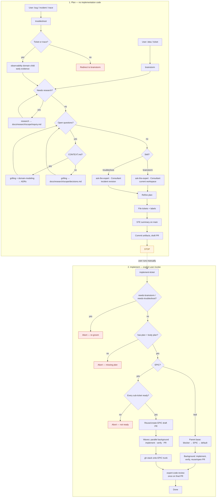

# Grok Build

Configuration and skills for [Grok Build](https://x.ai) (`~/.grok/`).

## Contents

| Path | Description |
| --- | --- |
| `config.toml` | Portable Grok config — models, UI theme, LSP feature flag, MCP servers, and permission rules. Uses **`${ENV}` placeholders** for secrets (see [MCP config](#mcp-config)). |
| `lsp.json` | LSP server configurations for TypeScript (typescript-language-server), Python (pyright), and Rust (rust-analyzer). |
| `skills/` | Agent skills (portable instructions invoked by name or automatically based on their description). |

### Domain specialists

`ask-the-expert` dispatches a general-purpose child per matched domain. The child reads [`skills/ask-the-expert/references/modes.md`](skills/ask-the-expert/references/modes.md) and one file under [`skills/ask-the-expert/references/domains/`](skills/ask-the-expert/references/domains/).

| Mode | When |
| --- | --- |
| **Consultant** | Default. Ideation, brainstorming, troubleshooting, and improvements to an implementation plan. Researches candidate libraries and leaves a choice among several to the user. |
| **Reviewer** | Only when the caller explicitly asks to review a pull request, branch, repository, or snippet. Creates or updates the repository bill of materials (name, version, license) and notes critical updates and CVEs. |

| Domain file | Purpose |
| --- | --- |
| `domains/bun.md` | Server-side JavaScript/TypeScript on Node.js, preferably Bun. |
| `domains/ci-cd.md` | Automation: GitHub Actions, Helm charts, Terraform, shell, container builds, Make / Just. |
| `domains/gis.md` | GIS and geospatial data: reading and writing datasets, clipping, merging, distance, and related operations. |
| `domains/observability.md` | Application performance monitoring, tracing, logging, metrics, and KPIs. Datadog is one platform. |
| `domains/postgres.md` | PostgreSQL queries and operations: SQL performance, missing indexes, query optimization. |
| `domains/python.md` | Server-side Python, serverless Python (for example AWS Lambda), and data analysis in Python. |
| `domains/rust.md` | Client- and server-side Rust. Servers prefer Tokio. Clients prefer the web and WebAssembly; cross-platform GUI and CLI/TUI are in scope. |
| `domains/spring-cloud.md` | Server-side Java on an LTS release, using Spring Boot and Spring Cloud. |
| `domains/swift.md` | Client- and server-side Swift, including desktop, mobile, web, WebAssembly, and CLI/TUI. |
| `domains/web-frontend.md` | Client-side JavaScript/TypeScript, HTML/CSS, and current browser platform features such as WebGPU. |
| `domains/ui-ux-design.md` | Progressive, fluent, mobile-first web UI/UX: design system, craft, and how a screen looks and flows. |

### Skills (`skills/`)

| Skill | Description |
| --- | --- |
| `ask-the-expert` | Consult domain specialists in Consultant mode, or in Reviewer mode when the caller asks for a review. Covers server-side JavaScript/TypeScript, CI/CD automation, observability, GIS, PostgreSQL, Python, Rust, Java with Spring Boot, Swift, web front-end, and web UI/UX. |
| `aws-sso-login` | AWS SSO login. Use when AWS CLI operations need SSO auth, or the SSO session has expired. |
| `brainstorm` | Plan an improvement ticket or idea into tracer-bullet work and tracker tickets. Ends with an STE summary on the main ticket, documented grilling decisions (ADRs or a `docs/research/` decisions note), readiness labels on every touched issue, and plan artifacts committed on the implement-ticket baseline branch with a draft PR ([Planning → implementation flow](#planning--implementation-flow)). |
| `datadog-health-report` | Datadog health report for a scoped area of responsibility. Use before a daily standup or SoS when you need metrics, logs, traces, monitors, SLOs, incidents, and dashboards synthesized. |
| `expert-code-review` | Review recently written or modified code, a branch, or a PR — including security, performance, idioms, architecture, or CI/CD (GitHub Actions, Terraform, Helm, shell pipelines). |
| `implement-ticket` | Execute a filed ticket or EPIC plan: branch, implement, PR, then one review on the final PR. Reuses the grooming baseline branch and draft PR when they exist. For EPICs, sequence by blockers, implement independent tickets in parallel, stack only the sub-ticket PRs onto the EPIC branch (stack trunk) using gh-stack, then review that stack once. |
| `issue-tracker` | Ticket identity, issue MCP, readiness labels, and git naming. Use when parsing a ticket id, fetching or creating a tracker issue, applying readiness labels, resolving parent/Epic or children, or naming a branch, commit, or PR from a ticket. |
| `query-postgres` | Query Postgres. Use to query, inspect, analyze, run ad hoc SQL, or explore schema. Read-only by default; `--write` only after explicit confirmation. |
| `test-containers` | IT test containers. Use to start or stop the containers a project's integration tests need (docker, podman, or the macOS container CLI). |
| `troubleshoot` | Diagnose a bug/incident (issue, or Datadog trace id) into a fix plan and tracer-bullet work. Same end-state gates as `brainstorm`, including plan artifacts on the implement-ticket baseline branch with a draft PR. |

### Required external skills

The following skills are **not included** in this repo, but are required for some of the above skills to work (`brainstorm`, `troubleshoot`, `implement-ticket`). Install them from their upstream sources.

| Skill | Description | Source |
| --- | --- | --- |
| `gh-stack` | Manage stacked branches and pull requests with the gh-stack GitHub CLI extension. Use when the user wants to create, push, rebase, sync, navigate, or view stacks of dependent PRs. Triggers on tasks involving stacked diffs, dependent pull requests, branch chains, or incremental code review workflows. | [github/gh-stack](https://github.com/github/gh-stack) (`skills/gh-stack`) |
| `grilling` | Grill the user relentlessly about a plan, decision, or idea. Use when the user wants to stress-test their thinking, or uses any 'grill' trigger phrases. | [mattpocock/skills](https://github.com/mattpocock/skills/tree/main/skills/productivity/grilling) |
| `grill-me` | A relentless interview to sharpen a plan or design. (User-invoked wrapper around `grilling`.) | [mattpocock/skills](https://github.com/mattpocock/skills/tree/main/skills/productivity/grill-me) |
| `domain-modeling` | Build and sharpen a project's domain model. Use when the user wants to pin down domain terminology or a ubiquitous language, record an architectural decision, or when another skill needs to maintain the domain model. (`brainstorm` / `troubleshoot` use it with `grilling` when root `CONTEXT.md` exists, including ADR capture.) | [mattpocock/skills](https://github.com/mattpocock/skills/tree/main/skills/engineering/domain-modeling) |
| `research` | Investigate a question against high-trust primary sources and capture the findings as a Markdown file in the repo. Use when the user wants a topic researched, docs or API facts gathered, or reading legwork delegated to a background agent. | [mattpocock/skills](https://github.com/mattpocock/skills/tree/main/skills/engineering/research) |

### Optional external skills

Useful companion skills that are **not required** by the skills in this repo. Handy for reading office documents, authoring agent docs, and multi-session learning.

| Skill | Description | Source |
| --- | --- | --- |
| `convert-documents-to-markdown` | Convert Word (.doc, .docx), PowerPoint (.ppt, .pptx), Excel (.xls, .xlsx), OpenDocument (.odt, .ods, .odp), RTF, EPUB, CSV, and PDF files to GitHub-Flavored Markdown. Use when a task needs the contents of an office document, spreadsheet, presentation, ebook, or PDF you cannot read directly. | [firecrawl/anydoc](https://github.com/firecrawl/anydoc/tree/main/skills/convert-documents-to-markdown) |
| `writing-for-agents` | Writing documents for agents. Use when creating or editing skills, or modifying AGENTS.md or CLAUDE.md. | [mattpocock/skills](https://github.com/mattpocock/skills/tree/main/skills/productivity/writing-for-agents) |

#### Install external skills

**gh-stack** (CLI extension + agent skill):

```sh
# GitHub CLI extension (required for `gh stack` commands)
gh extension install github/gh-stack

# Agent skill (so coding agents know how to drive stacked PRs)
gh skill install github/gh-stack
```

**mattpocock/skills** (required: `research`, `grilling`, `grill-me`, `domain-modeling`; optional: `writing-for-agents`; …):

```sh
# Codex and other agents — interactive picker; select the skills you need
npx skills@latest add mattpocock/skills

# Or install individual skills via the gh skill CLI, e.g.:
gh skill install mattpocock/skills research
gh skill install mattpocock/skills grilling
gh skill install mattpocock/skills domain-modeling
gh skill install mattpocock/skills grill-me

# Optional companions
gh skill install mattpocock/skills writing-for-agents
```

Claude Code can also install the full set as a managed plugin:

```sh
claude plugins install mattpocock-skills
```

**firecrawl/anydoc** (optional: `convert-documents-to-markdown`):

```sh
npx skills add firecrawl/anydoc
# or:
gh skill install firecrawl/anydoc
```

The skill drives the anydoc CLI (`npx -y @firecrawl/anydoc <file>`); Node 20+ is required. No separate global install is needed for one-off conversions.

See the upstream READMEs for details: [mattpocock/skills](https://github.com/mattpocock/skills), [github/gh-stack](https://github.com/github/gh-stack), [firecrawl/anydoc](https://github.com/firecrawl/anydoc).

### Planning → implementation flow

`brainstorm` and `troubleshoot` **plan, document decisions, and file tracker tickets** — they never write **implementation code**, run tests, or start `implement-ticket`. Allowed plan artifacts: one file per research inquiry under `docs/research/<scope>/` ([path rule](skills/brainstorm/references/research-grill-decisions.md)), `CONTEXT.md` / ADRs (via `domain-modeling`), and tracker creates/updates/comments. After filing, those plan artifacts are committed on the **implement-ticket baseline branch** (`branch_with_ticket` for the EPIC id, or for a leaf the ticket id) with a **draft** PR, so they merge with the work they inform. Implementation is always triggered manually by the user afterwards, via `implement-ticket` (which reuses that branch and draft PR, and rebases onto the current parent base — typically `main`/`master` — when the parent is not already an ancestor).

A screen, flow, or design-system question goes through `ask-the-expert`, which dispatches the `ui-ux-design` domain.

**End-state gates** (both skills; filing owned with `skills/brainstorm/references/tracer-ticket-breakdown.md`):

| Gate | Requirement |
| --- | --- |
| **STE summary on main** | Full plan + next steps in ASD-STE100 Simplified Technical English, posted as a **comment on the main ticket** (and shown to the user). Use ubiquitous language from `CONTEXT.md` when present. |
| **Decision capture** | Architectural decisions from grilling are on disk: **ADRs** via `domain-modeling` when root `CONTEXT.md` exists; otherwise a dated **Decisions** section in `docs/research/<scope>/decisions.md`. Skip only when grilling made none (state that in the plan). |
| **Labels** | Every issue **created or updated** in the run has the correct readiness label attached (`issue-tracker` **Extras**). |
| **Plan artifacts on baseline** | Changed `docs/research/` files / `CONTEXT.md` / ADRs are committed on the implement-ticket baseline branch (`branch_with_ticket` for the EPIC id, or for a leaf the ticket id) with a **draft** PR. Skip when none of those files changed. |



**No implicit handoff:** neither `brainstorm` nor `troubleshoot` may call `implement-ticket` or start the ticket implementation. The user must explicitly invoke `implement-ticket` for a filed ticket (or EPIC) to begin implementation. Implementation starts only when grooming labels are clear and a body plan is present (`has-plan` preferred); for EPICs, **every** sub-ticket (and the parent) must pass those readiness gates.

## Installation

Grok loads user config from `~/.grok/`. Project-scoped MCP/plugins/permissions can also live in `.grok/config.toml` inside a repo.

From the repo root, symlink skills (already the usual setup on this machine):

```sh
mkdir -p ~/.grok

ln -sfn "$(pwd)/ai/skills" ~/.grok/skills
```

### Config (`config.toml`)

**Do not blind-overwrite** `~/.grok/config.toml` if it already has marketplace or personal settings. Merge the sections you want from `ai/config.toml`:

| Section | What it carries |
| --- | --- |
| `[models]` | Default + web_search model (`grok-4.5`) |
| `[ui]` | Theme `auto` (system light/dark) |
| `[features]` | `lsp_tools = true` |
| `[session]` | Auto-compact threshold (partial stand-in for OpenCode DCP) |
| `[mcp_servers.*]` | crates-io, bun-mcp, datadog, github |
| `[permission]` | GitHub MCP ask/allow-read patterns |

### Layout reference

| Scope | Path |
| --- | --- |
| User config | `~/.grok/config.toml` |
| User TUI appearance | `~/.grok/pager.toml` (optional fine-grained UI) |
| User agents | `~/.grok/agents/<name>.md` |
| User skills | `~/.grok/skills/<name>/SKILL.md` |
| Project config | `.grok/config.toml` (MCP, plugins, permissions) |
| Project agents / skills | `.grok/agents/`, `.grok/skills/` |

### MCP config

MCP servers are defined under `[mcp_servers.*]` in `ai/config.toml`. Several need **per-user secrets** before they work. The repo uses `${ENV}` expansion so nothing sensitive is shared by default.

| Server | Env / fields | Notes |
| --- | --- | --- |
| `github` | `GITHUB_PERSONAL_ACCESS_TOKEN` | Classic or fine-grained PAT. Requires the `github-mcp-server` binary on `PATH`. |
| `datadog` | `DATADOG_MCP_TOKEN` | Used as `Bearer ${DATADOG_MCP_TOKEN}` for `mcp.datadoghq.eu`. **Disabled by default** (`enabled = false`). |
| `crates-io`, `bun-mcp` | usually none | Need `cratesio-mcp` / `bunx` available; no user token in-repo. |

Export tokens in your shell profile (or a secrets manager) before launching Grok:

```sh
export GITHUB_PERSONAL_ACCESS_TOKEN=ghp_...
export DATADOG_MCP_TOKEN=...   # when enabling Datadog MCP
```

Check connectivity with:

```sh
grok mcp list
grok mcp doctor
```

> [!WARNING]
> Never commit a populated config with real tokens. Only `${ENV}` placeholders should be tracked. Before `git add`/`commit`, confirm `git diff ai/config.toml` does not contain PATs, Bearer tokens, or other secrets.
